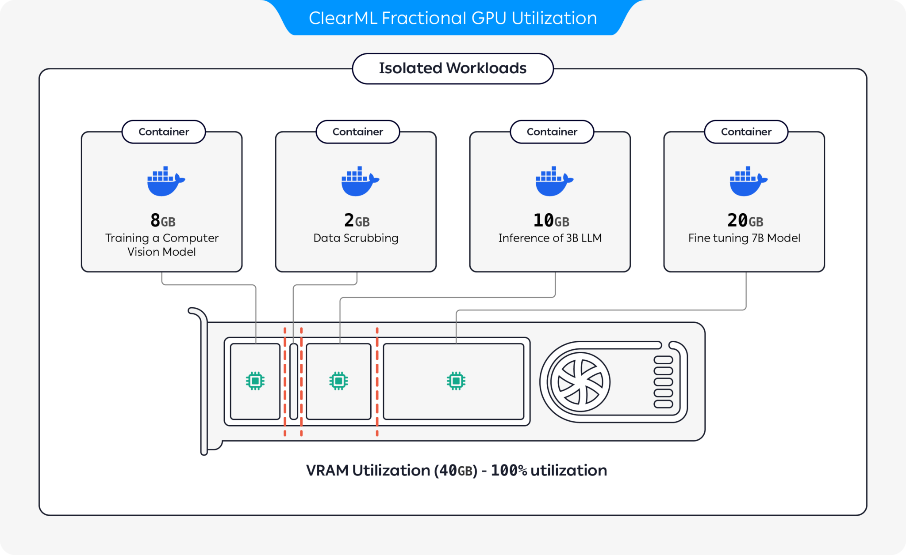

Some tasks that you send for execution need a minimal amount of compute and memory, but you end up allocating entire 
GPUs to them. In order to optimize your compute resource usage, you can partition GPUs into slices. You can have a GPU 
device run multiple isolated workloads on separate slices that will not impact each other, and will only use the 
fraction of GPU memory allocated to them. 

ClearML provides several GPU slicing options to optimize compute resource utilization:
* [Dynamic GPU Slicing](#dynamic-gpu-fractions): On-demand GPU slicing per task for both MIG and non-MIG devices (**Available under the ClearML Enterprise plan**):
* [Container-based Memory Limits](#container-based-memory-limits): Use pre-packaged containers with built-in memory 
limits to run multiple containers on the same GPU (**Available as part of the ClearML open source offering**)
* [Kubernetes-based Static MIG Slicing](#kubernetes-static-mig-fractions): Set up Kubernetes support for NVIDIA MIG 
(Multi-Instance GPU) to define GPU fractions for specific workloads (**Available as part of the ClearML open source offering**)
 
## Dynamic GPU Fractions

:::important Enterprise Feature
Dynamic GPU slicing is available under the ClearML Enterprise plan. 
:::

ClearML dynamic GPU fractions provide on-the-fly, per task GPU slicing, without having to set up containers or 
pre-configure tasks with memory limits. Specify a GPU fraction for a queue in the agent invocation, and every task the 
agent pulls from the queue will run on a container with the specified limit. This way you can safely run multiple tasks 
simultaneously without worrying that one task will use all of the GPU's memory. 

You can dynamically slice GPUs on:
* [Bare metal / VM](clearml_agent_deployment_bare_metal.md)
* Kubernetes: 
  * [ClearML Dynamic MIG Operator (CDMO)](fractional_gpus/cdmo.md) chart for MIG devices
  * [ClearML Fractional GPU Injector (CFGI)](fractional_gpus/cfgi.md) chart for non-MIG devices
  * [CDMO and CFGI on a shared cluster](fractional_gpus/cdmo_cfgi_same_cluster.md) for both MIG and non-MIG devices



## Container-based Memory Limits
Use [`clearml-fractional-gpu`](https://github.com/clearml/clearml-fractional-gpu)'s pre-packaged containers with 
built-in hard memory limitations. Workloads running in these containers will only be able to use up to the container's 
memory limit. Multiple isolated workloads can run on the same GPU without impacting each other. 

### Usage 

#### Manual Execution 

1. Choose the container with the appropriate memory limit. ClearML supports CUDA 11.x and CUDA 12.x with memory limits 
ranging from 2 GB to 12 GB (see [clearml-fractional-gpu repository](https://github.com/clearml/clearml-fractional-gpu/blob/main/README.md#-containers) for full list).
1. Launch the container:

   ```bash
   docker run -it --gpus 0 --ipc=host --pid=host clearml/fractional-gpu:u22-cu12.3-8gb bash 
   ```
   
   This example runs the ClearML Ubuntu 22 with CUDA 12.3 container on GPU 0, which is limited to use up to 8GB of its memory.
   :::note
   `--pid=host` is required to allow the driver to differentiate between the container's processes and other host processes when limiting memory usage
   :::
1. Run the following command inside the container to verify that the fractional gpu memory limit is working correctly:
   ```bash
   nvidia-smi
   ```
   Here is the expected output for the previous, 8GB limited, example on an A100: 
   ```bash
   +---------------------------------------------------------------------------------------+
   | NVIDIA-SMI 545.23.08              Driver Version: 545.23.08    CUDA Version: 12.3     |
   |-----------------------------------------+----------------------+----------------------+
   | GPU  Name                 Persistence-M | Bus-Id        Disp.A | Volatile Uncorr. ECC |
   | Fan  Temp   Perf          Pwr:Usage/Cap |         Memory-Usage | GPU-Util  Compute M. |
   |                                         |                      |               MIG M. |
   |=========================================+======================+======================|
   |   0  A100-PCIE-40GB                Off  | 00000000:01:00.0 Off |                  N/A |
   | 32%   33C    P0              66W / 250W |      0MiB /  8128MiB |      3%      Default |
   |                                         |                      |             Disabled |
   +-----------------------------------------+----------------------+----------------------+
                                                                                            
   +---------------------------------------------------------------------------------------+
   | Processes:                                                                            |
   |  GPU   GI   CI        PID   Type   Process name                            GPU Memory |
   |        ID   ID                                                             Usage      |
   |=======================================================================================|
   +---------------------------------------------------------------------------------------+
   ```
#### Remote Execution

You can set a ClearML Agent to execute tasks in a fractional GPU container. Set an agent’s default container via its 
command line. For example, all tasks pulled from the `default` queue by this agent will be executed in the Ubuntu 22 
with CUDA 12.3 container, which is limited to use up to 8GB of its memory:

```bash
clearml-agent daemon --queue default --docker clearml/fractional-gpu:u22-cu12.3-8gb
```

The agent’s default container can be overridden via the UI: 
1. Clone the task
1. Set the Docker in the cloned task's **Execution** tab > **Container** section
   
   
   

1. Enqueue the cloned task

The task will be executed in the container specified in the UI.

For more information, see [Docker Mode](clearml_agent_execution_env.md#docker-mode).

#### Fractional GPU Containers on Kubernetes
Fractional GPU containers can be used to limit the memory consumption of your Kubernetes Job/Pod, and have multiple 
containers share GPU devices without interfering with each other.

For example, the following configures a K8S pod to run using the `clearml/fractional-gpu:u22-cu12.3-8gb` container, 
which limits the pod to 8 GB of the GPU's memory:
```
apiVersion: v1
kind: Pod
metadata:
  name: train-pod
  labels:
    app: trainme
spec:
  hostPID: true
  containers:
  - name: train-container
    image: clearml/fractional-gpu:u22-cu12.3-8gb
    command: ['python3', '-c', 'print(f"Free GPU Memory: (free, global) {torch.cuda.mem_get_info()}")']
```

:::note
`hostPID: true` is required to allow the driver to differentiate between the pod's processes and other host processes 
when limiting memory usage.
:::

### Custom Container
Build your own custom fractional GPU container by inheriting from one of ClearML's containers: In your Dockerfile, make 
sure to include `From <clearml_container_image>` so the container will inherit from the relevant container.

See example custom Dockerfiles in the [clearml-fractional-gpu repository](https://github.com/clearml/clearml-fractional-gpu/tree/main/examples).

## Kubernetes Static MIG Fractions
Set up NVIDIA MIG (Multi-Instance GPU) support for Kubernetes to define GPU fraction profiles for specific workloads 
through your NVIDIA device plugin.

The standard way to configure a Kubernetes pod template to use specific MIG slices is for the template to specify the 
requested GPU slices under `Containers.resources.limits`. For example, the 
following configures a K8S pod to run a `3g.20gb` MIG device:

```
# tf-benchmarks-mixed.yaml
apiVersion: v1
kind: Pod
metadata:
 name: tf-benchmarks-mixed
spec:
 restartPolicy: Never
 Containers:
    - name: tf-benchmarks-mixed
    image: ""
     command: []
     args: []
     resources:
       limits:
         nvidia.com/mig-3g.20gb: 1
 nodeSelector:  #optional
   nvidia.com/gpu.product: A100-SXM4-40GB
```

The ClearML Agent Helm chart lets you specify a pod template for each queue which describes the resources that the pod 
will use. The ClearML Agent uses this configuration to generate the necessary Kubernetes pod template for executing 
tasks based on the queue through which they are scheduled.

When tasks are added to the relevant queue, the agent pulls the task and creates a pod to execute it, using the 
specified GPU slice.

For example, the following configures tasks from the default queue to use `1g.5gb` MIG slices:
```
agentk8sglue:
 queue: default
 # …
 basePodTemplate:
   # …
   resources:
     limits:
       nvidia.com/gpu: 1
   nodeSelector:
     nvidia.com/gpu.product: A100-SXM4-40GB-MIG-1g.5gb
```

