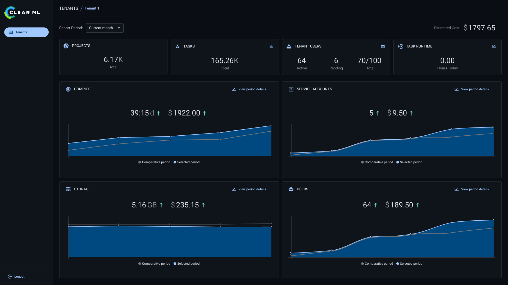

# ClearML Documentation

## Overview
Welcome to the documentation for ClearML, the end-to-end platform for streamlining AI development and deployment. ClearML consists of three essential layers:
1. [**Infrastructure Control Plane**](#infrastructure-control-plane) (Cloud/On-Prem Agnostic)
2. [**AI Development Center**](#ai-development-center)
3. [**GenAI App Engine**](#genai-app-engine)

Each layer provides distinct functionality to ensure an efficient and scalable AI workflow from development to deployment.

---

## Infrastructure Control Plane
The Infrastructure Control Plane serves as the foundation of the ClearML platform, offering compute resource provisioning and management, enabling administrators to make the compute available through GPUaaS capabilities and no-hassle configuration.  
Utilizing the Infrastructure Control Plane, DevOps and IT teams can manage and optimize GPU resources to ensure high performance and cost efficiency.

#### Features
- **Resource Management:** Automates the allocation and management of GPU resources.
- **Workload Autoscaling:** Seamlessly scale GPU resources based on workload demands.
- **Monitoring and Logging:** Provides comprehensive monitoring and logging for GPU utilization and performance.
- **Cost Optimization:** Consolidate cloud and on-prem compute into a seamless GPUaaS offering 
- **Deployment Flexibility:** Easily run your workloads on both cloud and on-premises compute.

---

## AI Development Center
The AI Development Center offers a robust environment for developing, training, and testing AI models. It is designed to be cloud and on-premises agnostic, providing flexibility in deployment.

#### Features
- **Integrated Development Environment:** A comprehensive IDE for training, testing, and debugging AI models.
- **Model Training:** Scalable and distributed model training and hyperparameter optimization.
- **Data Management:** Tools for data preprocessing, management, and versioning.
- **Experiment Tracking:** Track metrics, artifacts, and logs. Manage versions, and compare results.
- **Workflow Automation:** Build pipelines to formalize your workflow

---

## GenAI App Engine
The GenAI App Engine is designed to deploy large language models (LLM) into GPU clusters and manage various AI workloads, including Retrieval-Augmented Generation (RAG) tasks. This layer also handles networking, authentication, and role-based access control (RBAC) for deployed services.

#### Features
- **LLM Deployment:** Seamlessly deploy LLMs into GPU clusters.
- **RAG Workloads:** Efficiently manage and execute RAG workloads.
- **Networking and Authentication:** Deploy GenAI through secure, authenticated network endpoints
- **RBAC:** Implement RBAC to control access to deployed services.

---

## Platform Management Center

The [Platform Management Center](webapp/platform_management_center.md) provides an administrative dashboard for all 
tenants across a ClearML deployment. 

It enables platform administrators to monitor tenant activity, usage, and costs.

---

## Getting Started
To begin using the ClearML, follow these steps:
1. **Set Up Infrastructure Control Plane:** Allocate and manage your GPU resources.
2. **Develop AI Models:** Use the AI Development Center to develop and train your models.
3. **Deploy AI Models:** Deploy your models using the GenAI App Engine.

For detailed instructions on each step, refer to the respective sections in this documentation.

---

## Support
For feature requests or bug reports, see ClearML on [GitHub](https://github.com/clearml/clearml/issues).

If you have any questions, join the discussion on the **ClearML** [Slack channel](https://joinslack.clear.ml), or tag your questions on [Stack Overflow](https://stackoverflow.com/questions/tagged/clearml) with the **clearml** tag.

Lastly, you can always find us at [support@clearml.ai](mailto:support@clearml.ai?subject=ClearML).