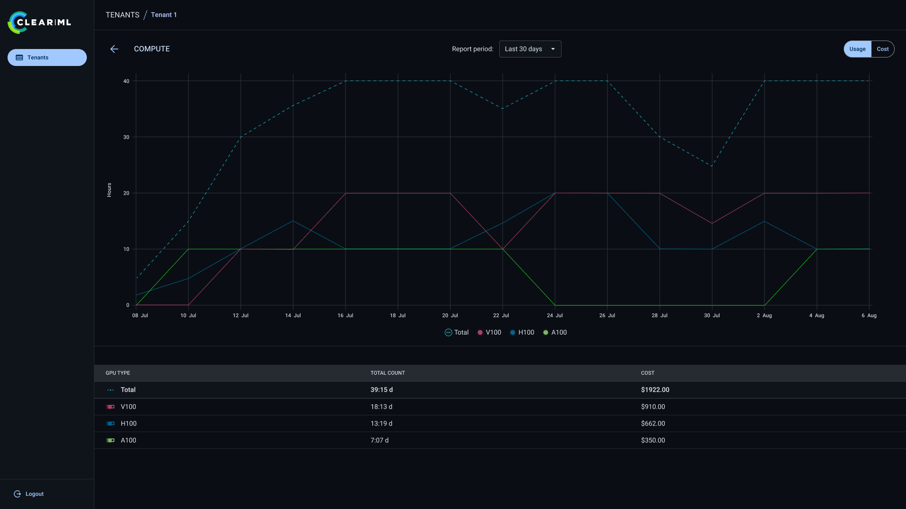

:::important
The Platform Management Center is available under the ClearML Enterprise plan.
:::

The **Platform Management Center** provides an administrative dashboard for all tenants across a ClearML deployment. 
It enables platform administrators to monitor tenant activity, usage, and costs.

## Tenants Overview
The Platform Management Center tenant's page displays a list of all tenants in the ClearML deployment.

For each tenant, its name, UUID, and the list of its administrators and their e-mail addresses are displayed.

Select a tenant to open its administrative dashboard.

## Tenant Dashboard
The tenant dashboard shows a collection of usage metrics. Cost totals and breakdown is available to the extent any costs 
were defined for the [metered events](../deploying_clearml/enterprise_deploy/extra_configs/event_metering.md).

At the top of the tenant dashboard, the following summary metrics are displayed:
* Estimated Cost - Displays the tenant's estimated cost for the selected time range, summed across all metered events.
  :::important 
  Estimated costs and cost breakdowns are displayed only if any costs are associated with any of the metered events. See [Event metering](../deploying_clearml/enterprise_deploy/extra_configs/event_metering.md).
  :::

* Projects - Current total number of projects in the tenant.
* Tasks - Current total number of tasks in the tenant. Click the graph icon  
  to show a plot of new tasks created over time
* Tenant Users - Breakdown of tenant users:
  * Active users
  * Pending (registered, but never logged in) users
  * Total users (active + pending), alongside the tenant's configured user quota
  
  Click to open a list of the tenant's users and their details (email, ID, role, etc.). 

* Task Runtime - Total task runtime (in hours) for the current day. Click the graph icon  
  to show a detailed breakdown:
  * Task runtime over time, by queue 
  * Relative runtime totals by queue

The dashboard also shows plots for all additional metered events. By default, ClearML meters:
* Cluster Compute
* Users and Service Accounts
* ClearML Storage

Metered events plots display:
* Selected period - Event count over the selected report period
* Reference period - Event count over the previous equivalent period (e.g. usage for the previous 7 days)
* Trend indicator - Displays the total increase or decrease compared to the previous period. 

Click **View Period Details** for a detailed breakdown of an event's data.

In the details view, you can:
* Adjust the **Report Period** specifically for that event
* Show either:
  * Usage - View usage over time and a breakdown by event categories (e.g. Compute: usage per GPU type, Storage: usage per storage service)
  * Cost - View cost over time and a breakdown by event categories (e.g. Compute: cost per GPU type, Storage: cost per storage service)
  * Category totals for the period are also available below the chart.

## Deployment

For deployment instructions, see [Platform Management Center](../deploying_clearml/enterprise_deploy/extra_configs/platform_management_center_deploy.md). 

